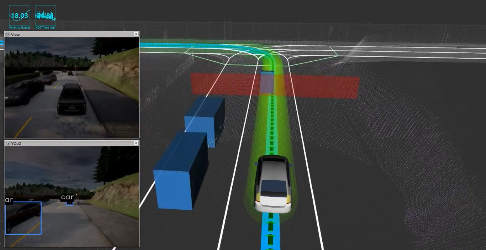

# Autoware in CARLA

Check the CARLA documentation [here](https://carla.readthedocs.io/en/latest/) to see further details of the integration.

## CARLA Autoware agent

A demonstrator of an autoware agent ready to be executed with CARLA can be found [here](https://github.com/carla-simulator/carla-autoware)

## Further Documentation and Support

[CARLA Documentation](https://carla.readthedocs.io/en/latest/)

[CARLA ROS Bridge Documentation](https://github.com/carla-simulator/ros-bridge/blob/master/README.md)

[CARLA Discord](https://discord.gg/8kqACuC)
